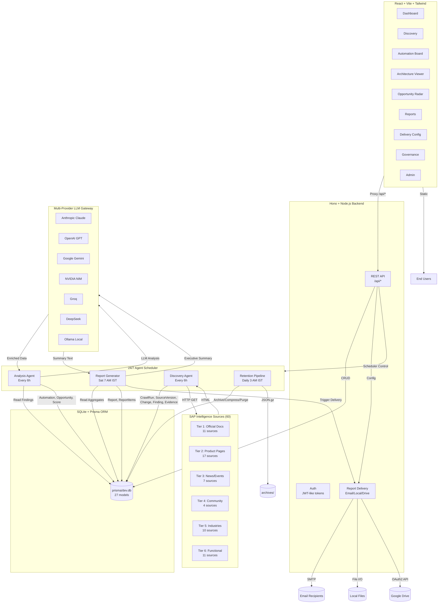

> **Enterprise-grade intelligence platform delivering automated analysis of SAP ecosystem developments, capabilities, and strategic automation opportunities.**

---

## Overview

**SAIE (SAP Automation Intelligence Engine)** is a production-ready platform that continuously monitors 60+ official SAP sources, extracts automation intelligence using multi-provider AI, and delivers weekly executive-grade reports to decision-makers.

SAIE solves the critical challenge of staying current with SAP's rapidly evolving technology landscape — from S/4HANA and BTP to Joule AI, Build Process Automation, and Clean Core transformation — by automating the discovery, analysis, and prioritization of automation opportunities.

---

## Problem

### The Challenge

Organizations investing in SAP transformation face a fundamental intelligence gap:

| Pain Point | Impact |
|------------|--------|
| **Information Overload** | 60+ SAP product pages, documentation hubs, news channels, community sites, and industry portals publish updates daily |
| **Manual Monitoring** | Teams spend 10–20 hours/week manually checking sources for relevant changes |
| **Delayed Discovery** | Critical capability announcements (e.g., new AI features, deprecations, API changes) are missed for weeks |
| **No Prioritization** | Raw information lacks business context — which changes actually enable high-value automation? |
| **Inconsistent Delivery** | Intelligence is scattered across Slack, email, docs — no executive-ready format |
| **Evidence Gap** | Decisions lack traceability to source material; confidence levels are subjective |

### Why Existing Approaches Fail

- **RSS/Newsletter subscriptions** — Too noisy, no filtering for automation relevance
- **Manual researcher teams** — Expensive, slow, inconsistent coverage
- **Generic web monitors** — Don't understand SAP domain concepts (Clean Core, BTP, Joule, CAP, etc.)
- **Static reports** — Outdated by the time they reach leadership

---

## Solution

SAIE implements a **24/7 autonomous agent pipeline** that transforms raw SAP web content into prioritized, evidence-backed automation intelligence.

### Complete Workflow

```
┌─────────────┐     ┌─────────────┐     ┌─────────────┐     ┌─────────────┐     ┌─────────────┐
│  DISCOVERY  │────▶│   CRAWL     │────▶│  ANALYSIS   │────▶│  SCORING    │────▶│   REPORT    │
│   AGENT     │     │   AGENT     │     │   AGENT     │     │   AGENT     │     │  GENERATOR  │
└─────────────┘     └─────────────┘     └─────────────┘     └─────────────┘     └─────────────┘
     │                   │                   │                   │                   │
     ▼                   ▼                   ▼                   ▼                   ▼
• 60+ SAP sources   • Real HTTP fetch   • Content parsing   • 8-factor scoring  • Executive HTML
• Tiered authority  • SHA-256 change    • Keyword extraction  • Evidence weighting  • PDF/CSV/JSON
• Priority ordering  • Version tracking  • AI enhancement    • Composite ranking  • Multi-channel
                    • Rate limiting     • Pattern matching  • Confidence levels  • Email/Drive/Local
```

### Agent Pipeline Details

| Agent | Schedule | Function |
|-------|----------|----------|
| **Discovery** | Every 6 hours | Crawls 60 real SAP URLs across 6 authority tiers |
| **Analysis** | Every 6 hours | Extracts findings, creates automations, scores opportunities |
| **Report Generator** | Saturday 7:00 AM IST | Builds consulting-grade executive report |
| **Delivery** | Post-generation | Sends via Email (SMTP), Local files, Google Drive (OAuth2) |
| **Retention** | Daily 3:00 AM IST | Archives/compresses/purges data per 30/90/365-day policy |

### Intelligence Output

- **Findings** — Evidence-backed changes with confidence scores (confirmed/corroborated/inferred)
- **Automations** — Extracted patterns: RPA, AI-assisted, Event-driven, Predictive, Process automation
- **Opportunities** — Scored using 8-factor methodology (Business Value 20%, Automation Potential 15%, Technical Feasibility 15%, Reusability 15%, Demand 10%, Differentiation 10%, Clean-Core Relevance 10%, Complexity Penalty -15%)
- **Architecture** — Evidence-backed node/edge diagrams for each automation pattern
- **Reports** — McKinsey/Bain-style executive briefings with cover page, KPI dashboard, strategic findings, methodology

---

## Key Features

### Core Intelligence Features
- **Real Web Crawling** — Fetches live content from 60 official SAP sources (not synthetic data)
- **Change Detection** — SHA-256 content hashing detects meaningful updates vs. noise
- **Tiered Source Authority** — 6 tiers from official documentation (Tier 1) to community blogs (Tier 6)
- **Automation Pattern Extraction** — Classifies into RPA, AI-assisted, Event-driven, Predictive, Process automation
- **Evidence Chaining** — Every finding links to source URL, crawl run, and content excerpt

### AI-Enhanced Analysis
- **Multi-Provider LLM Support** — Anthropic, OpenAI, Google Gemini, NVIDIA NIM, Groq, DeepSeek, Ollama
- **Auto-Detection** — Uses first available API key; falls back to content-based scoring
- **Executive Summaries** — LLM-generated C-suite narratives from top findings
- **Finding Enrichment** — AI adds summary, opportunities, risks, recommendations

### Scoring & Prioritization
- **8-Factor Composite Score** — Weighted methodology validated against SAP transformation patterns
- **Evidence-Level Weighting** — Confirmed sources score higher than inferred
- **Source Tier Bonus** — Official docs (Tier 1) get +15, Product pages (Tier 2) get +10
- **Override Capability** — Manual score adjustments with audit trail

### Report Delivery (3 Channels)
1. **Email (SMTP)** — HTML + PDF + CSV + JSON attachments, Gmail/Brevo/Mailgun/Outlook support
2. **Local Files** — Auto-saves to configured directory every Saturday
3. **Google Drive** — OAuth2 upload with folder organization and sharing

### Governance & Operations
- **Review Queue** — Human-in-the-loop validation for findings/automations/opportunities
- **Audit Log** — Immutable trail of all system actions
- **Agent Observability** — Token usage, latency, cost, success/failure tracking
- **Data Retention** — Automated 30/90/365-day tiered archival with monthly compressed JSON.gz archives

### Frontend Dashboard (React + TypeScript)
- **Weekly Pulse** — KPIs, domain charts, automation type distribution, recent changes
- **Discovery** — Source management by tier, live crawl triggers, crawl run history
- **Automation Board** — Card-based view with detail drill-down
- **Architecture Viewer** — Interactive SVG node/edge diagrams
- **Opportunity Radar** — Score breakdown bars + radar chart visualization
- **Saturday Reports** — Full report browser with highlights
- **Delivery Settings** — Visual SMTP/Google Drive/Local configuration with test buttons
- **Governance** — Review queue, audit log, agent run analytics
- **Administration** — Scoring weights, system health, platform config

---

## How It Works

### 1. Source Configuration (Seeded at Setup)
60 real SAP URLs organized into 6 authority tiers:

```
Tier 1 (11): Official Documentation — help.sap.com, cap.cloud.sap, api.sap.com
Tier 2 (17): Official Product Pages — S/4HANA, BTP, Build, Integration Suite, AI Core, etc.
Tier 3 (7):  Official News & Events — news.sap.com, Sapphire, Innovation Guide
Tier 4 (4):  Community & Blogs — community.sap.com, Joule hub, learning.sap.com
Tier 5 (10): Industry Domains — Aerospace, Automotive, Banking, Healthcare, etc.
Tier 6 (11): Functional & Migration — FI/CO, SCM, HCM, CRM, ABAP Cloud, Migration
```

### 2. Crawl Execution (Every 6 Hours)
```
For each active source (priority → tier order):
  1. HTTP GET with SAIE User-Agent, 20s timeout
  2. Parse HTML: title, headings (h1–h4), paragraphs, meta description
  3. Extract automation keywords (60+ SAP-specific terms)
  4. Compute SHA-256 content hash
  5. Compare with previous version → detect changes
  6. Create SourceVersion + CrawlRun records
  7. If changed: create Change record + Finding + Evidence
  8. If automation keywords ≥ 4: create Automation + Opportunity + Scores
  9. Rate limit: 1 second between requests
```

### 3. Analysis & Enrichment (Every 6 Hours)
```
For each "new" finding:
  1. Check for existing automation → skip if exists
  2. If LLM available: call analyzeWithLLM() for summary + opportunities
  3. Create Automation record (type inferred from keywords)
  4. Score opportunity using content-derived 8-factor model
  5. Create Score records for each factor with rationale
  6. Update finding status → "validated"
```

### 4. Report Generation (Saturday 7:00 AM IST)
```
1. Aggregate counts: sources, changes, findings, automations, opportunities
2. Rank top 20 findings by confidence + recency
3. If LLM available: generate executive summary via callLLM()
4. Create Report + ReportItems (top 3 highlighted)
5. Generate HTML (consulting-grade), CSV, JSON
6. Deliver via all configured channels
7. Log to audit trail
```

### 5. Data Retention (Daily 3:00 AM IST)
```
Tier 1 (0–30 days):   Full detail — all fields queryable
Tier 2 (30–90 days):  Compressed — summaries only, raw content archived to JSON.gz
Tier 3 (90–365 days): Aggregated — monthly stats only, individual records deleted
Tier 4 (365+ days):   Purged — deleted entirely (confirmed findings preserved)
```

---

## Architecture



### Component Communication

| Layer | Technology | Communication |
|-------|------------|---------------|
| **Frontend → Backend** | React + Vite | REST via `/api/*` (proxied to `localhost:3001`) |
| **Backend → Database** | Hono + Prisma Client | Type-safe ORM queries |
| **Backend → LLM** | Custom `llm-client.ts` | HTTP to provider APIs (OpenAI-compatible + Anthropic + Gemini) |
| **Backend → Sources** | Native `fetch` | HTTP GET with custom User-Agent |
| **Backend → Email** | Nodemailer | SMTP (STARTTLS) |
| **Backend → Google Drive** | Native `fetch` | OAuth2 refresh token → access token → Drive API v3 |
| **Scheduler → Agents** | In-process `setInterval` | Direct async function calls |

---

## Technology Stack

### Frontend
| Category | Technology | Version |
|----------|------------|---------|
| Framework | React | 18.3.0 |
| Build Tool | Vite | 5.4.0 |
| Language | TypeScript | 5.6.0 |
| Styling | Tailwind CSS | 4.1.18 |
| UI Components | Radix UI + shadcn/ui patterns | 1.4.3 |
| Charts | Recharts | 2.15.3 |
| Icons | Lucide React | 0.460.0 |
| State | React Hooks (useState, useEffect, useCallback) | — |

### Backend
| Category | Technology | Version |
|----------|------------|---------|
| Runtime | Node.js (via `tsx`) | 22+ |
| Framework | Hono | 4.0.0 |
| Server | @hono/node-server | 1.13.0 |
| Language | TypeScript | 5.6.0 |
| Database ORM | Prisma Client | 6.19.3 |
| Database Engine | SQLite (file-based) | — |

### Database
| Component | Technology |
|-----------|------------|
| Engine | SQLite (`file:./dev.db`) |
| ORM | Prisma 6.19.3 |
| Migrations | `prisma migrate` / `prisma db push` |
| Models | 27 (User, Source, CrawlRun, SourceVersion, Change, Finding, Evidence, Automation, ArchitectureNode, ArchitectureEdge, Opportunity, Score, Report, ReportItem, Review, AgentRun, AuditLog) |

### AI / LLM Providers
| Provider | API Style | Models (Default) |
|----------|-----------|------------------|
| Anthropic | Messages API (`x-api-key`) | `claude-sonnet-4-20250514` |
| OpenAI | Chat Completions (Bearer) | `gpt-4o` |
| Google Gemini | `generateContent` (query key) | `gemini-2.0-flash` |
| NVIDIA NIM | OpenAI-compatible | `meta/llama-3.1-70b-instruct` |
| Groq | OpenAI-compatible | `llama-3.1-70b-versatile` |
| DeepSeek | OpenAI-compatible | `deepseek-chat` |
| Ollama (Local) | OpenAI-compatible | `llama3.1:70b` |

**Priority Order:** Anthropic → OpenAI → Gemini → NVIDIA → Groq → DeepSeek → Ollama

### External Services
| Service | Purpose | Integration |
|---------|---------|-------------|
| SMTP (Gmail/Brevo/Mailgun/Outlook/Yahoo) | Email delivery | Nodemailer |
| Google Drive API v3 | Report archival/sharing | OAuth2 (refresh token flow) |
| SAP Public Web | Intelligence sources | Direct HTTP (no API key) |

### Development Tools
| Tool | Purpose |
|------|---------|
| `tsx` | TypeScript execution (no build step) |
| `vite` | Frontend dev server + build |
| `prisma` | Database schema, migrations, client generation |
| `tailwindcss` + `@tailwindcss/postcss` | Utility-first CSS |
| `postcss` | CSS processing |
| `eslint` (implicit via TS) | Type-checking |

### Deployment
| Target | Configuration |
|--------|---------------|
| Local Development | `npm run dev` (frontend:3000) + `npm run server` (backend:3001) |
| Production Build | `npm run build` → `dist/` |
| Database Setup | `npm run setup` (generate + push + seed) |

---

## Project Structure

```text
SAIE/
├── .github/
│   └── workflows/           # (to be added) CI/CD pipelines
├── prisma/
│   ├── schema.prisma        # 27-model database schema
│   ├── migrations/          # (generated) migration history
│   └── dev.db               # SQLite database (gitignored)
├── src/
│   ├── components/
│   │   ├── ui/              # 21 shadcn-style UI primitives
│   │   ├── LoginPage.tsx    # Auth screen with animated background
│   │   └── StructureFlowBackground.tsx  # Animated network visualization
│   ├── lib/
│   │   ├── cn.ts            # className utility (clsx + tailwind-merge)
│   │   └── db.ts            # Prisma client export
│   ├── App.tsx              # Main app: routing, views, data fetching
│   ├── main.tsx             # React entry point
│   ├── index.css            # Tailwind imports + global styles
│   └── ShogoErrorBoundary.tsx  # Error boundary wrapper
├── archives/                # Data retention archives (gitignored)
├── reports/                 # Local report exports (gitignored)
├── node_modules/            # Dependencies (gitignored)
├── .env                     # Secrets (gitignored)
├── .env.example             # Template for environment variables
├── .gitignore               # Git ignore rules
├── LICENSE                  # MIT License
├── package.json             # Manifest + scripts
├── package-lock.json        # Lockfile
├── tsconfig.json            # TypeScript config
├── vite.config.ts           # Vite config (proxy to :3001)
├── postcss.config.mjs       # PostCSS + Tailwind v4
├── server-node.ts           # Hono backend entry (port 3001)
├── custom-routes.ts         # 100+ API routes (/api/*)
├── llm-client.ts            # Multi-provider LLM gateway
├── agent-scheduler.ts       # 24/7 scheduler + 4 agents
├── report-delivery.ts       # 3-channel delivery (Email/Local/Drive)
├── data-retention.ts        # 30/90/365-day tiered retention
├── seed-local.ts            # Seeds 60 real SAP sources
├── START.bat                # Windows launcher
└── setup.bat                # Windows setup script
```

### Key Directories Explained

| Path | Purpose |
|------|---------|
| `prisma/` | Database schema, migrations, local SQLite file |
| `src/components/ui/` | Reusable UI primitives (Button, Card, Dialog, Table, etc.) |
| `src/lib/` | Shared utilities (Prisma client, className helper) |
| `archives/` | Monthly compressed JSON.gz archives from retention pipeline |
| `reports/` | Saturday report exports (HTML/JSON/CSV) |

---

## Getting Started

### Prerequisites

- **Node.js** ≥ 20 (tested on 22)
- **npm** ≥ 10 (bundled with Node)
- **Git** for version control
- **AI API Key** (optional but recommended) — one of: Anthropic, OpenAI, Gemini, NVIDIA, Groq, DeepSeek, or local Ollama

### Installation

```bash
# 1. Clone the repository
git clone https://github.com/GanTechProject/SAIE.git
cd SAIE

# 2. Install dependencies
npm install

# 3. Configure environment
cp .env.example .env
# Edit .env and add at least one AI API key:
# ANTHROPIC_API_KEY=sk-ant-...
# OR OPENAI_API_KEY=sk-proj-...
# OR GEMINI_API_KEY=AIza...

# 4. Initialize database + seed sources
npm run setup
# This runs: prisma generate → prisma db push → seed-local.ts

# 5. Start development servers (two terminals)
# Terminal 1: Backend API (port 3001)
npm run server

# Terminal 2: Frontend dev server (port 3000)
npm run dev

# 6. Open http://localhost:3000
# Login: admin@saie.local / admin
```

### Windows Quick Start

```cmd
# Double-click or run:
START.bat
# This runs setup + starts both servers
```

---

## Configuration

### Environment Variables

| Variable | Required | Default | Description |
|----------|----------|---------|-------------|
| `DATABASE_URL` | Yes | `file:./dev.db` | SQLite path relative to `prisma/schema.prisma` |
| `ANTHROPIC_API_KEY` | No | — | Anthropic Claude API key |
| `OPENAI_API_KEY` | No | — | OpenAI GPT API key |
| `GEMINI_API_KEY` | No | — | Google Gemini API key |
| `NVIDIA_API_KEY` | No | — | NVIDIA NIM API key |
| `GROQ_API_KEY` | No | — | Groq API key |
| `DEEPSEEK_API_KEY` | No | — | DeepSeek API key |
| `OLLAMA_HOST` | No | `http://localhost:11434` | Local Ollama endpoint |
| `SMTP_HOST` | No | `smtp.gmail.com` | SMTP server for email delivery |
| `SMTP_PORT` | No | `587` | SMTP port (587 STARTTLS, 465 SSL) |
| `SMTP_USER` | No | — | SMTP username (email) |
| `SMTP_PASS` | No | — | SMTP app password |
| `SMTP_FROM` | No | `SMTP_USER` | From address |
| `SMTP_FROM_NAME` | No | `SAIE Intelligence Engine` | From display name |
| `EMAIL_RECIPIENTS` | No | — | Comma-separated report recipients |
| `LOCAL_EXPORT_PATH` | No | `./reports` | Directory for local report files |
| `EXPORT_FORMATS` | No | `html,json,csv` | Comma-separated export formats |
| `GOOGLE_DRIVE_ENABLED` | No | `false` | Enable Google Drive upload |
| `GOOGLE_DRIVE_CLIENT_ID` | No | — | OAuth2 client ID |
| `GOOGLE_DRIVE_CLIENT_SECRET` | No | — | OAuth2 client secret |
| `GOOGLE_DRIVE_REFRESH_TOKEN` | No | — | OAuth2 refresh token |
| `GOOGLE_DRIVE_FOLDER_ID` | No | — | Target folder ID (optional) |
| `GOOGLE_DRIVE_SHARED_WITH` | No | — | Comma-separated emails to share with |
| `SCHEDULE_DAY` | No | `saturday` | Report generation day |
| `SCHEDULE_TIME` | No | `07:00` | Report generation time (24h) |
| `SCHEDULE_TIMEZONE` | No | `Asia/Kolkata` | IANA timezone for schedule |
| `PORT` | No | `3001` | Backend server port |

### AI Provider Setup

SAIE auto-detects the first available API key in priority order. **Only one is needed.**

```bash
# Option 1: Anthropic (recommended for quality)
ANTHROPIC_API_KEY=sk-ant-...

# Option 2: OpenAI
OPENAI_API_KEY=sk-proj-...

# Option 3: Google Gemini (free tier available)
GEMINI_API_KEY=AIza...

# Option 4: NVIDIA NIM
NVIDIA_API_KEY=nvapi-...

# Option 5: Groq (fast, free tier)
GROQ_API_KEY=gsk_...

# Option 6: DeepSeek
DEEPSEEK_API_KEY=sk-...

# Option 7: Local Ollama (free, private)
OLLAMA_HOST=http://localhost:11434
# Pull model first: ollama pull llama3.1:70b
```

### Email Delivery Setup (Gmail Example)

1. Enable 2FA on Google account
2. Generate App Password: https://myaccount.google.com/apppasswords
3. Configure:
```env
SMTP_HOST=smtp.gmail.com
SMTP_PORT=587
SMTP_USER=your-email@gmail.com
SMTP_PASS=xxxx-xxxx-xxxx-xxxx  # App password (no spaces)
EMAIL_RECIPIENTS=lead@company.com,cto@company.com
```

### Google Drive Setup

1. Google Cloud Console → New Project → Enable Drive API
2. Create OAuth2 credentials (Web application)
3. Add redirect URI: `http://localhost:3001/api/auth/google/callback`
4. Get refresh token via OAuth2 playground or custom script
5. Configure:
```env
GOOGLE_DRIVE_ENABLED=true
GOOGLE_DRIVE_CLIENT_ID=xxx.apps.googleusercontent.com
GOOGLE_DRIVE_CLIENT_SECRET=GOCSPX-xxx
GOOGLE_DRIVE_REFRESH_TOKEN=1//0xxx
GOOGLE_DRIVE_FOLDER_ID=1BxiMVs0XRA5nFMdKvBdBZjgmUUqptlbs74OgVE2upms
GOOGLE_DRIVE_SHARED_WITH=team@company.com
```

---

## Database Setup

SAIE uses **SQLite with Prisma ORM** — zero external dependencies.

### Commands

```bash
# Generate Prisma Client (after schema changes)
npx prisma generate

# Push schema to database (dev, accepts data loss)
npx prisma db push --accept-data-loss

# Run migrations (production)
npx prisma migrate deploy

# Open Prisma Studio (GUI)
npx prisma studio

# Seed 60 real SAP sources
npx tsx seed-local.ts

# Full setup (generate + push + seed)
npm run setup
```

### Schema Overview (27 Models)

```
User → authentication & roles
Source → 60 SAP URLs (tiered authority)
CrawlRun → execution log per source crawl
SourceVersion → content snapshot with hash
Change → diff between versions
Finding → intelligence insight (confirmed/corroborated/inferred)
Evidence → source excerpt supporting finding
Automation → extracted pattern (RPA, AI, Event, Predictive, Process)
ArchitectureNode/Edge → technical diagram for automation
Opportunity → scored business opportunity (8-factor)
Score → individual factor breakdown
Report → weekly executive package
ReportItem → finding inclusion in report
Review → human governance decisions
AgentRun → observability (tokens, cost, latency)
AuditLog → immutable system action trail
```

---

## Running the Application

### Development Mode

```bash
# Terminal 1: Backend (API + Scheduler)
npm run server
# → http://localhost:3001
# → Health: GET /api/health

# Terminal 2: Frontend (Vite + React)
npm run dev
# → http://localhost:3000
# → Proxies /api/* to :3001
```

### Production Build

```bash
# Build frontend
npm run build
# Output: dist/

# Run backend (serves static frontend if configured)
npm run server
```

### Manual Pipeline Execution

```bash
# Run full pipeline once (crawl → analyze → report)
curl -X POST http://localhost:3001/api/scheduler/run-pipeline

# Crawl all sources
curl -X POST http://localhost:3001/api/crawl-all

# Generate report only
curl -X POST http://localhost:3001/api/scheduler/run-report

# Run data retention
curl -X POST http://localhost:3001/api/retention/run
```

### Scheduler Control

```bash
# Start 24/7 scheduler
curl -X POST http://localhost:3001/api/scheduler/start

# Stop scheduler
curl -X POST http://localhost:3001/api/scheduler/stop

# Check status
curl http://localhost:3001/api/scheduler/status
```

---

## Development

### Project Scripts

```json
{
  "dev": "vite --port 3000",                    # Frontend dev server
  "server": "npx tsx server-node.ts",           # Backend + scheduler
  "seed": "npx tsx seed-local.ts",              # Seed 60 SAP sources
  "build": "vite build",                        # Production build
  "setup": "npx prisma generate && npx prisma db push --accept-data-loss && npx tsx seed-local.ts"
}
```

### Adding New SAP Sources

Edit `seed-local.ts` or `custom-routes.ts` seed endpoint:

```typescript
{ 
  url: 'https://www.sap.com/products/new-product.html', 
  name: 'SAP New Product', 
  type: 'product', 
  domain: 'official', 
  category: 'new_category',
  priority: 2, 
  tier: 2, 
  active: true 
}
```

### Modifying Scoring Weights

Edit `agent-scheduler.ts` → `scoreFromContent()` and `custom-routes.ts` → `/scoring/weights` endpoint. Keep weights summing to 1.0 (excluding penalty).

### Adding LLM Providers

Edit `llm-client.ts` → `PROVIDER_PRIORITY` array. Implement API call in `callOpenAICompatible()` or add new `call<Provider>()` function.

---

## Testing

Currently no automated test suite. Manual verification:

```bash
# Health check
curl http://localhost:3001/api/health

# LLM status
curl http://localhost:3001/api/llm/status

# Test crawl single source
curl -X POST http://localhost:3001/api/crawl -H "Content-Type: application/json" -d '{"sourceId": "<id>"}'

# Test email delivery
curl -X POST http://localhost:3001/api/delivery/test-email -H "Content-Type: application/json" -d '{"smtpUser":"...","smtpPass":"..."}'

# Seed and verify
npm run seed
curl http://localhost:3001/api/sources | jq '.sources | length'
# Should return 60
```

---

## Security

### Secrets Management

- **Never commit `.env`** — Added to `.gitignore`
- **Use `.env.example`** as template
- **Rotate keys** if accidentally exposed
- **App passwords** for SMTP (not login passwords)
- **OAuth2 refresh tokens** for Google Drive (short-lived access tokens)

### Authentication

- Simple token-based auth (email + timestamp, base64 encoded)
- Default user: `admin@saie.local` / `admin`
- **Production requirement**: Replace with proper auth (bcrypt, JWT, OAuth2)

### Data Protection

- SQLite file contains business intelligence — restrict file permissions
- Audit log tracks all mutations
- No PII stored beyond email addresses for delivery

### Network

- Backend binds to `0.0.0.0:3001` — restrict via firewall in production
- Frontend proxy only in development
- CORS enabled for all origins (configure for production)

---

## Contributing

We welcome contributions! Please follow these guidelines:

### Development Workflow

1. Fork the repository
2. Create a feature branch: `git checkout -b feature/amazing-feature`
3. Make changes with clear, focused commits
4. Run lint/type-check: `npx tsc --noEmit`
5. Test manually (see Testing section)
6. Submit a Pull Request

### Code Standards

- **TypeScript strict mode** — no `any` without justification
- **ESLint + Prettier** (via IDE) — consistent formatting
- **Conventional Commits** — `feat:`, `fix:`, `docs:`, `refactor:`, `chore:`
- **Component structure** — Colocate types, components, hooks

### Areas for Contribution

- [ ] Automated test suite (Vitest + Playwright)
- [ ] Additional LLM providers (Azure OpenAI, Bedrock, Vertex AI)
- [ ] More SAP source tiers (partner sites, analyst reports)
- [ ] Enhanced architecture diagram layout (force-directed)
- [ ] Multi-tenant support with row-level security
- [ ] Webhook notifications (Slack, Teams, PagerDuty)
- [ ] Kubernetes deployment manifests
- [ ] OpenTelemetry observability

---

## Roadmap

### v2.1 — Enhanced Intelligence (Q1 2026)
- [ ] Vector embeddings for semantic change detection
- [ ] Cross-source correlation engine
- [ ] Predictive trend forecasting

### v2.2 — Platform Hardening (Q2 2026)
- [ ] Multi-tenant RBAC with Prisma middleware
- [ ] PostgreSQL support for production scale
- [ ] Kubernetes operator + Helm charts
- [ ] OpenTelemetry + Grafana dashboards

### v2.3 — Ecosystem Integration (Q3 2026)
- [ ] SAP BTP Event Mesh integration (real-time)
- [ ] SAP Build Process Automation connector
- [ ] SAP Signavio process mining correlation
- [ ] LeanIX EAM synchronization

### v3.0 — Agentic Automation (Q4 2026)
- [ ] Autonomous implementation planning agents
- [ ] Code generation for CAP/ABAP extensions
- [ ] Test case generation from findings
- [ ] Deployment pipeline integration

---

## License

This project is licensed under the **MIT License** — see the [LICENSE](LICENSE) file for details.

```
MIT License
Copyright (c) 2026 GanTechProject
```

---

## Author / Organization

**GanTechProject** — Building intelligence platforms for enterprise transformation.

- Repository: https://github.com/GanTechProject/SAIE
- Issues: https://github.com/GanTechProject/SAIE/issues

---

## Quick Reference

### Key API Endpoints

| Endpoint | Method | Description |
|----------|--------|-------------|
| `/api/health` | GET | System health + LLM status |
| `/api/dashboard` | GET | KPIs + charts data |
| `/api/sources` | GET | All 60 sources with counts |
| `/api/crawl` | POST | Crawl single source |
| `/api/crawl-all` | POST | Crawl all active sources |
| `/api/findings` | GET | All findings with evidence |
| `/api/automations` | GET | All automations |
| `/api/architecture/:id` | GET | Node/edge diagram data |
| `/api/opportunities` | GET | Scored opportunities |
| `/api/reports` | GET | All Saturday reports |
| `/api/delivery/config` | GET/POST | Delivery configuration |
| `/api/delivery/send` | POST | Trigger report delivery |
| `/api/scheduler/status` | GET | Scheduler state + logs |
| `/api/scheduler/run-pipeline` | POST | Manual full pipeline |
| `/api/retention/status` | GET | Retention stats + archives |
| `/api/retention/run` | POST | Manual retention pipeline |
| `/api/seed` | POST | Seed 60 SAP sources |

### Default Login

```
Email:    admin@saie.local
Password: admin
```

### Ports

| Service | Port | URL |
|---------|------|-----|
| Frontend (Vite) | 3000 | http://localhost:3000 |
| Backend (Hono) | 3001 | http://localhost:3001 |
| API Base | 3001 | http://localhost:3001/api |